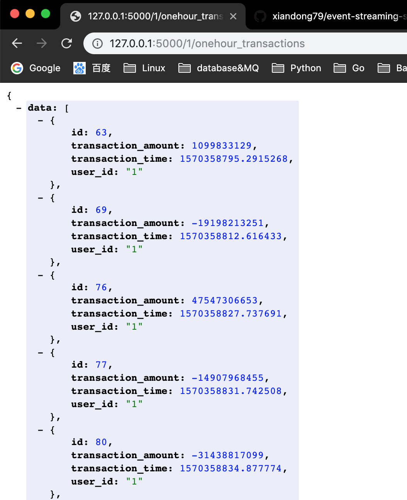

# event-streaming-system
A simple event streaming system, a pub/sub step using Redis, storage using Mysql, Web framework using flask.

## Background

In our bank, we have a continuous flow of data coming from different customer activities. One of the most common ones are credit card transactions.

Target:
1. Build a fake emitter of credit card transactions with random time intervals
2. Set-up a pub/sub system to capture those events
3. Using the consumer system pattern of choice, aggregate all transactions by a given user in the last time interval (e.g. 6 hours) and:
    1. Save into a database
    2. Open an API that gives the sum of the transactions
    3. Displays list of transactions
    
## Design Philosophy

Description of your solution including:

### a. Decision on stack components and why

- Redis for Pub/Sub and in-memory store

Message queue is not the biggest advantage of Redis, an in-memory data structure store. However, if we have a large consumer group. Redis is a component that must be maintained and used efficiently. For example, the latest 5 trades/transactions of each user should be stored in the Redis instead of MySQL for speed.

    - Redis Pub/Sub implements the messaging system where the senders (in redis terminology called publishers) sends the messages while the receivers (subscribers) receive them. The link by which the messages are transferred is called channel. In Redis, a client can subscribe any number of channels.
    - easy to use with pyredis
    - widely used
    
- MYSQL for data persistence

Wechat Pay, a financial organization which supports 80 million active users everyday, also select MYSQL as their database for data persistence
. With the following reasons:

    - The Flexibility of Open Source.
    - Data Security. 
    - On-Demand Scalability. 
    - High Performance. 
    - Round-the-clock Uptime. 
    - Comprehensive Transactional Support.
    - Complete Workflow Control.
    
- flask for web application framework


    - simplicity, a very quick start
    - flexibility, add new modules if you want
    - fine-grained control

But I have to say that 'One of the main advantages of Django, is that it has a huge active developer community. This means that if you need help, or when it’s time to scale your app, you will have an easier job finding other developers to join in and start contributing, plus a wealth of useful content already in the public domain. '

### b. Description on how the pieces interact

### c. Suggestions on if this were to be moved from a demo to a real system what considerations would you make?

if we are in the real system with more and more users.

    1. Redis pub/sub with multiple producers and multiple consumers
    2. Redis as in-memory data structure store for frequently used data
    3. A Redis Cluster
    4. a MySQL cluster
    5. Optimization on MySQL tables, for example:
        1. use `Optimize table` command
        2. add suitable combination-primary keys and union combination keys
        3. optimize all the query
        4. split big table if it has too many columns or rows 
    6. ...    
     

## Quickstart and Showcase


### 1. install MySQL and Redis in your computer. 

For example, if you using MacOS

```bash
brew install mysql
brew install redis
```

### 2. set up a database and table in your MySQL. 

You can use `Datagrip` IDE.

    DataGrip is a database management environment for developers. It is designed to query, create and manage databases. Databases can work locally, on a server, or in the cloud. Supports MySQL, PostgreSQL, Microsoft SQL Server, Oracle, and more.
    
### 3. run the pub/sub and store the transaction into MySQL

The message is like `1,-44690489068,1570358269.4836092`. The first field is `user_id`, the second field is `transaction_amount`, the third field is `transaction_time`.
    
```bash
pip install -r requirements.txt

python emiiter_and_pub.py

python sub_and_store.py

# log:
10/06/2019 06:37:49 PM INFO pub_transactions: 1,-44690489068,1570358269.4836092
10/06/2019 06:37:52 PM INFO pub_transactions: 2,20596488508,1570358272.48946
10/06/2019 06:37:57 PM INFO pub_transactions: 1,-27269658564,1570358277.493473
10/06/2019 06:37:59 PM INFO pub_transactions: 3,41603904384,1570358279.49744
``` 

### 4. launch flask APP for RESTful API

You can run flask APP in pycharm directly or use the command line.

```bash
export FLASK_APP=app.py
$ python -m flask run

* Running on http://127.0.0.1:5000/ (Press CTRL+C to quit)
```

